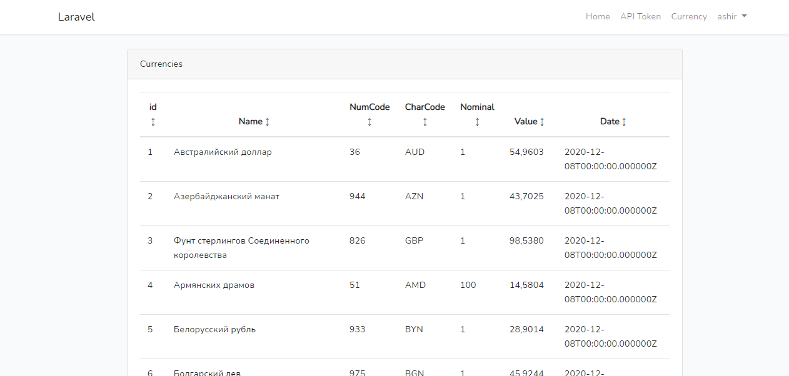

<!-- PROJECT LOGO -->
<br />
<p align="center">
  <a href="https://github.com/bilalahmed-1994/currencyconverter">
    
  </a>

  <h3 align="center">Currency App</h3>

  <p align="center">
    Simple laravel and vue js project
  </p>
</p>


<!-- ABOUT THE PROJECT -->
## About The Project

Simple currency viewer app
**Build with laravel and vue js**.


### Built With

* laravel
* vue js
* REST APIs


<!-- GETTING STARTED -->
## Getting Started

To get a local copy up and running follow these simple steps.

### Prerequisites

This is an example of how to list things you need to use the software and how to install them.

* npm
* composer

### Installation

* composer
  ```sh
  composer install
  ```

* npm
  ```sh
  npm install
  ```

* npm
```sh
npm run dev
  ```
* php
```sh
php artisan key:generate
  ```
* DB SCHEMA
```sh
php artisan migrate
  ```
* DB SEEDER
```sh
php artisan db:seed
  ```
* php
```sh
php artisan serve
  ```


### REST APIs

1. API POSTMAN exports to file named: 'currencyconverter.postman_collection'.


### COMMANDS
1. command to import the data from api to DB
```sh
php artisan command:ImportCurrencyRates
  ```
2. Command to create the user.
```sh
php artisan command:CreateUser {email} {password}
  ```
